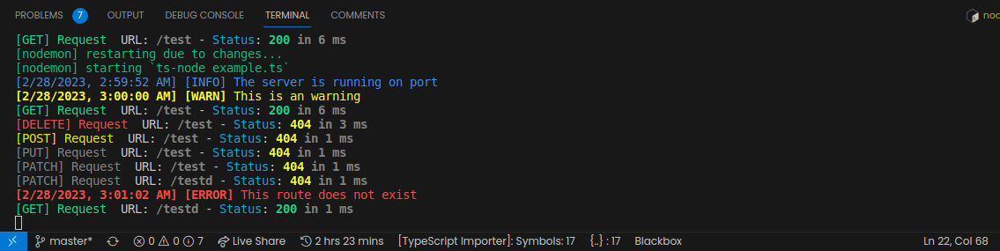
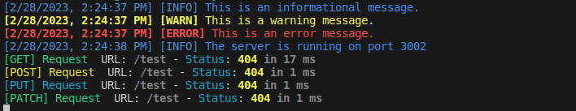
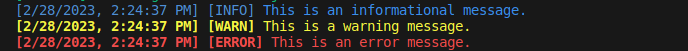
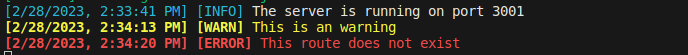
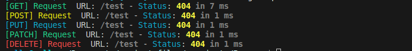
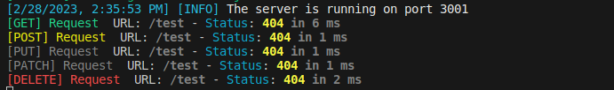

# Borgen🏅 (The developers👨‍💻 logger)

[![NPM Version][npm-version-image]][npm-url]
[![NPM Downloads][npm-downloads-image]][npm-url]
[](https://coveralls.io/github/Codedwells/Borgen?branch=master)

The custom Logger for your **Node-Express app**.

A HTTP request logger middleware for nodeJs



<br>

---

<br>

## Installation🏗️

This is a [Node.js](https://nodejs.org/en/) module available through the
[npm registry](https://www.npmjs.com/). Installation is done using the
[`npm install` command](https://docs.npmjs.com/getting-started/installing-npm-packages-locally):

```sh
$ npm i borgen
```

**If you use yarn:**
```sh
$ yarn add borgen
```

**If you use pnpm:**
```sh
$ pnpm add borgen
```

<br>

---

<br>

## 🚀Usage

```js
const { Logger, Borgen } = require('borgen');
```
```ts
import { Logger,Borgen } from 'borgen';
```

### Basic use
This is the simplest way you can use Borgen, you can however customize \
the colors it uses in logging.

```js
const express = require('express');
const { Logger, Borgen } = require('borgen');

const app = express();
app.use(Borgen({}))

Logger.info({message: 'This is an informational message.'});
Logger.warn({message:'This is a warning message.'});
Logger.error({message:'This is an error message.'})

app.listen('3002', () => {
    Logger.info({ message: 'The server is running on port 3002'});
});
```


## Available Customizations: 🌞Colors
- `black`
- `red`
- `green`
- `yellow`
- `blue`
- `magenta`
- `cyan`
- `white`
- `blackBright` (alias: `gray`, `grey`)
- `redBright`
- `greenBright`
- `yellowBright`
- `blueBright`
- `magentaBright`
- `cyanBright`
- `whiteBright`


<br>

---

<br>

## Logger💬

<br>

### Basic usage

```js
Logger.info({message: 'This is an informational message.'});
Logger.warn({message:'This is a warning message.'});
Logger.error({message:'This is an error message.'})
```


### Customizing the Colors🧰
You can fully customize the color for your log.

Logger has three options:
- Logger.info( )
- Logger.warn( )
- Logger.error( )


> Each Logger option has defaults and will fallback if no arguments are passed

```js
const express = require('express');
const { Logger, Borgen } = require('borgen');

const app = express();

app.get('/test', (req, res) => {
    Logger.warn({ message: 'This is an warning', infoColor: 'yellow', messageColor: 'yellowBright' });
    res.send('Hello world').end();
});

app.get('*', (req, res) => {
    Logger.error({ message: 'This route does not exist', infoColor: 'red', messageColor: 'redBright' });
    res.send('404 not found');
});

app.listen('3001', () => {
   Logger.info({ message: 'The server is running on port 3001', infoColor: 'cyanBright', messageColor: 'whiteBright' });
});
```

<br>

### Logger arguments💥
- `message` This is the information you want to be logged to the console.
- `infoColor` This is the color of the first section of the log.
- `messageColor` This is will be the color of the message you want to log.

<br>

> Note: infoColor and messageColor are optional and if not passed the logger will\
> will use the fallback configuration.

<br>

Use `CTRL + space` or `Options + space` with infoColor and messageColor to get all\
the colors available.

<br>

---

<br>

## Borgen middleware
This middleware  is able to handle all you incoming requests and you can \
**customize** the colors they are logged in.

### Basic use
```js
app.use(Borgen({}))
```


### 🧰Customizing the Colors
You can fully customize the color for your incoming requests.

```js
const express = require('express');
const { Logger, Borgen } = require('borgen');

const app = express();
app.use(
    Borgen({
        methodColor: {
            GET: 'greenBright',
            POST: 'yellow',
            PUT: 'gray',
            PATCH: 'gray',
            DELETE: 'redBright'
        },
        routeColor: 'gray',
        statusColor: 'cyan',
        resTimeColor: 'gray',
        statusCodesCl: { serverErr: 'red', clientErr: 'yellow', redirects: 'cyan', success: 'greenBright' }
    })
);

app.listen('3001', () => {
   Logger.info({ message: 'The server is running on port 3001', infoColor: 'cyanBright', messageColor: 'whiteBright' });
});
```


### Borgen arguments💥
- `methodColor` it is an Object which allows you to specify a specific color for different request types.
- `routeColor` it is the color of the route of the request e.g **/api/v1/users**.
- `statusColor` it is the color of the status text
- `resTimeColor` it is the color of how long it took the request to process and give a response.
- `statusCodesCl` it is where you specify the color of status codes in different ranges
  - `serverErr` for **5xx**
  - `clientErr` for **4xx**
  - `redirects` for **3xx**
  - `success` for **2xx**

> Note: All this arguments are optional and if not passed the logger will\
> will use the fallback configuration.

<br>

## 💪🏽 Thanks to all the awesome Contributors

Thanks a lot for spending your time helping Borgen grow. Thanks a lot! Keep rocking🍻


<br>

---

<br>

## License📑

[MIT](https://github.com/Codedwells/Borgen/blob/master/LICENSE)


[npm-downloads-image]: https://badgen.net/npm/dm/borgen
[npm-url]: https://npmjs.org/package/borgen
[npm-version-image]: https://badgen.net/npm/v/borgen

